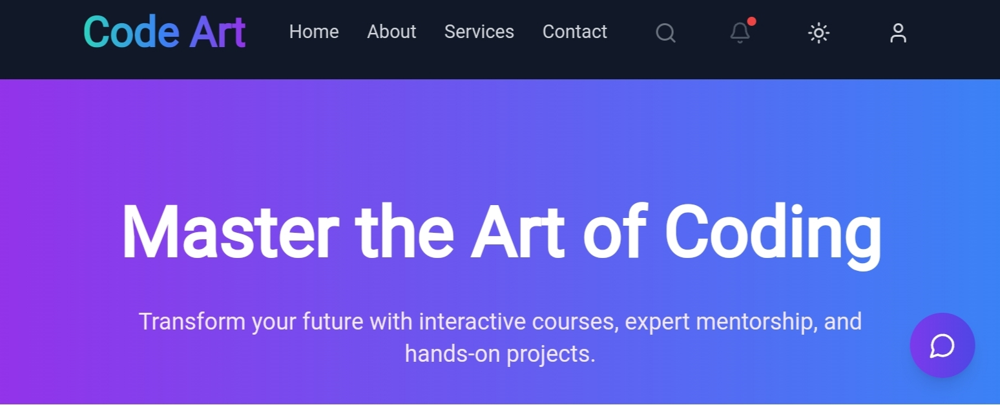

# Code Art Webpage

**Live Website**: [Visit the Site](https://code-art-rho.vercel.app/)

## 📌 Project Description

**Code Art** is a visually appealing and interactive webpage that showcases creative coding and design elements. This project is an exploration of art generated through code, providing a unique blend of aesthetics and functionality.

## 🌟 Features

- **Interactive Designs**: Engaging and dynamic visuals generated programmatically.  
- **Responsive Layout**: Ensures the website looks good across all devices.  
- **Performance Optimized**: Fast load times and smooth animations.  
- **User-Friendly**: Clean and intuitive interface for an enjoyable user experience.  

## 🚀 Live Demo

Check out the live version here:  
[**Code Art Webpage**](https://code-art-rho.vercel.app/)

---

## 📸 Screenshots

(Replace these placeholders with your actual screenshots.)

### Screenshot 1  


### Screenshot 2  


---

## 🛠️ Tech Stack

The following technologies were used to build this project:

- **Frontend**:  
  - HTML  
  - CSS  
  - JavaScript  
- **Hosting**:  
  - Vercel  

---

## 📥 Installation Instructions

Follow these steps to run the project locally:

1. Clone the repository:
   ```bash
   git clone https://github.com/GautamSharma-coder/Code-art.git
   cd Code-art
2. Install package
     ```bash
     npm Install
     npm start 
